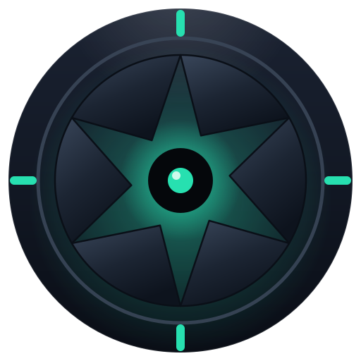

<div align="center">



# Daimon

**Give any AI eyes, hands, and a face on your desktop — safely.**

A local daemon for **macOS and Windows** that lets any MCP‑capable AI client
*see* your screen, *act* on it, and *show* you what it's doing — under a safety
ceiling **Daimon enforces itself**.

[](https://github.com/ArboRithmDev/Daimon/releases/latest)
[](LICENSE)
[](#install)
[](pyproject.toml)
[](https://modelcontextprotocol.io)

[Install](#install) · [The triad](#the-triad) · [Security](#security-model) ·
[Architecture](ARCHITECTURE.md) · [Tools](#tool-reference) · [Contributing](CONTRIBUTING.md)

</div>

---

Daimon speaks the standard [Model Context Protocol](https://modelcontextprotocol.io),
so it works with **any** client — Claude Code, Claude Desktop, Cursor, Codex,
Copilot CLI, Antigravity, and more — and is tied to **none**.

It is an *organ*, not a driver: **pull, not push.** Daimon owns no loop and
**calls no AI** — the client connects over MCP and pulls a sense or moves a hand
only when *it* wants to. Everything runs locally and the source is open, so you
can audit exactly what it does with your screen.

> [!WARNING]
> **Public beta.** Daimon works end‑to‑end — installed, driving real apps — on
> macOS (signed + notarized) and Windows (the Windows build is **not yet
> code‑signed**, so SmartScreen will warn on first run). It is young: start at a
> low ceiling, read the [security model](#security-model), and please
> [report issues](https://github.com/ArboRithmDev/Daimon/issues).

---

## The triad

### 👁 Perceive — the senses

Daimon supplies pixels and structure only. It does **no** vision or OCR itself;
the client looks with its own eyes. Output is bounded by default to keep token
cost low (`max_depth`, `root`, `roles`, `region`, `summary`, …).

> One scoped exception: `vue_find` runs **on‑device** OCR to locate a *visible
> label* and return clickable coordinates when there is no accessibility tree to
> click (WinDev / old Win32 / custom‑drawn / Electron). It is a **locator** — it
> returns a position, not a reading of the screen (localisation ≠ interprétation) —
> and never leaves the machine (no network).

| Sense | What it gives | Tools |
|-------|---------------|-------|
| **Vue** | screen capture (raw pixels) | `vue_snapshot`, `vue_displays` |
| **Touché — passif** | accessibility tree of a window | `touche_tree` |
| **Touché — actif** | the element under a point | `touche_probe` |

### ✋ Act — the hands

Acting is a separate organ governed by a ceiling **Daimon enforces** (default
**L0**, hands off). The AI can never raise its own limit.

| Level | Scope | Gate |
|-------|-------|------|
| **L0** READ | nothing | — |
| **L1** NONDESTRUCTIVE | scroll, focus, navigate, hover | none |
| **L2** INPUT | click, type, key, drag | none, unless the target is a *point of no return* |
| **L3** VALIDATION | engaging buttons | human confirmation on any non‑return |
| **L4** AUTONOMOUS | full autonomy | none — everything traced to a ledger |

Tools: `main_click`, `main_type`, `main_key`, `main_drag`, `main_hover`,
`main_press`, `main_navigate`, `main_activate` (+ L4‑gated held‑input
primitives `main_mouse_down/up`, `main_key_down/up`).

### 🪞 Show — the face

A premium, click‑through, capture‑invisible overlay highlights what the agent
targets, ripples where it clicks, and **emphasises the exact element you confirm
at the gate**. Never on an action's critical path. Off by default.

Tools: `overlay_highlight`, `overlay_spotlight`, `overlay_cursor`,
`overlay_banner`, `overlay_clear`.

---

## Security model

Daimon is built so an AI can act on your machine *safely*. The guarantees are
enforced in Daimon, not requested from the AI:

- **Daimon owns the ceiling, not the client.** Any AI plugs in; none is trusted.
  The AI cannot raise its own limit.
- **Points of no return** (send / delete / pay / drop‑on‑Trash …) are classified
  on the **observed** element — the AI re‑probes the real target, so a lying
  agent can't dodge the gate by mislabelling a button — and gated by a **native
  OS confirmation** (a macOS dialog; a Windows Secure Desktop prompt). Timeout = deny.
- **L4 full autonomy** unlocks only when a human types an engagement phrase
  out‑of‑band; consent is recorded in an append‑only, hash‑chained ledger.
  `no‑log = no‑act`, and a forged state file cannot escalate to L4.
- **Secrets never leave.** Secret‑role fields (macOS `AXSecureTextField` /
  Windows UIA password fields) and declared apps are blanked in Touché and
  blacked out in Vue, *before* anything is served.
- **Kill it at any time.** The physical override always wins.

Full threat model and the enforcement chain: **[SECURITY.md](SECURITY.md)**.
To report a vulnerability privately, see the same file.

---

## Install

### macOS

1. Download `Daimon-<version>.dmg` from the [latest release](https://github.com/ArboRithmDev/Daimon/releases/latest).
2. Open it and drag **Daimon** to **Applications**.
3. Launch **Daimon** — the 
   Duo glyph appears in the menu bar (no Dock icon). First run opens the
   onboarding window.
4. **Register your AI clients** (one click) and **grant** Screen Recording +
   Accessibility when guided.
5. Restart your AI client. It now has `vue_*`, `touche_*`, `main_*`, `overlay_*`.

The menu‑bar dropdown lets you set the **hands ceiling** (L0–L3), toggle the
overlay, re‑run setup, open config/logs, and quit — any time.

> [!NOTE]
> macOS permissions attach to the **app that launches Daimon** (your terminal /
> IDE / AI app), not to `Daimon.app` — the onboarding explains this. See
> [ARCHITECTURE.md](ARCHITECTURE.md#permissions--tcc) for why.

The DMG is a signed **Developer ID** build, **notarized** and **stapled** by
Apple, so Gatekeeper accepts it without a right‑click bypass.

### Windows

1. Download `Daimon-<version>-setup.exe` from the [latest release](https://github.com/ArboRithmDev/Daimon/releases/latest).
2. Run it — a **per‑user** install (`%LOCALAPPDATA%\Programs\Daimon`, no admin
   prompt). The build is **not yet code‑signed**, so SmartScreen shows a warning:
   choose **More info → Run anyway**.
3. Launch **Daimon** — the Duo glyph appears in the notification tray. Click it
   to open the panel (perceive/act status, clients, hands ceiling, overlay,
   setup). First run offers onboarding.
4. **Register your AI clients** and restart them. They now have `vue_*`,
   `touche_*`, `main_*`, `overlay_*`.

> [!NOTE]
> Windows needs no Screen Recording / Accessibility grants — capture is BitBlt
> and the UI tree is UI Automation. Requires Windows 10 2004+ and the Microsoft
> **WebView2 runtime** (preinstalled with current Windows / Edge). When an app
> exposes no UI Automation tree (some WinDev / custom‑drawn apps), use
> `vue_find` to locate a label by on‑device OCR and click it by coordinates.

### Supported AI clients

Auto‑detected, one‑click registration, fully reversible:

Claude Code · Claude Desktop · Cursor · Windsurf · GitHub Copilot CLI · Codex
(CLI + Desktop) · Mistral Vibe · Antigravity (Desktop / IDE / CLI).

Registration is idempotent and **backed up** — a malformed client config is
refused, never overwritten. Codex and Vibe use TOML; Daimon edits a
`# DAIMON:START/END` marker block in place and leaves the rest untouched.

---

## Tool reference

What your AI sees once Daimon is connected.

| Tool | Organ | Summary |
|------|-------|---------|
| `vue_displays` | 👁 | List displays and their geometry. |
| `vue_snapshot` | 👁 | Capture a display (bounded width; secret apps blacked out). |
| `touche_tree` | 👁 | Accessibility tree of a window (bounded by depth/role/region). |
| `touche_probe` | 👁 | Inspect the element under a point. |
| `main_click` | ✋ | Click (left/right/middle, double, modifiers). |
| `main_type` | ✋ | Type text into the focused field. |
| `main_key` | ✋ | Discrete key or chord (e.g. `cmd+shift+r`). |
| `main_hover` | ✋ | Move the pointer without clicking. |
| `main_navigate` | ✋ | Non‑destructive scroll. |
| `main_drag` | ✋ | Drag; the drop destination is classified for reversibility. |
| `main_press` | ✋ | Engage a button via the Accessibility API (L3). |
| `main_activate` | ✋ | Bring an app/window frontmost. |
| `main_mouse_down`/`up`, `main_key_down`/`up` | ✋ | Held‑input primitives (L4 only, watchdog auto‑release). |
| `overlay_*` | 🪞 | Highlight, spotlight, cursor halo, banner, clear. |

Every motor tool takes an `intent` string and a `reversible` declaration;
Daimon **verifies** reversibility on the observed target rather than trusting the
label. See [ARCHITECTURE.md](ARCHITECTURE.md) for the act → guard → gate →
actuate pipeline.

---

## Run from source

```bash
pip install -e ".[dev]"
daimon setup        # register into detected clients + guide permissions
daimon serve        # the MCP stdio server (what clients launch)
```

CLI: `daimon install [--all] | uninstall | status | onboard | setup`.
Set the ceiling in `~/Library/Application Support/Daimon/config/motor.yaml`
(or via the menu bar). Unlock L4: `python -m daimon.motor.control engage`.

## Build the installers

**macOS** — see [`build/macos/README.md`](build/macos/README.md). Requires Xcode
CLT, an Apple Developer ID, notary credentials, and `librsvg` for the brand icon
(`brew install librsvg`). Then:

```bash
./build/macos/build_macos.sh            # PyInstaller → sign → DMG → notarize → staple
./build/macos/build_macos.sh --no-sign  # fast local build, no signing
```

**Windows** — requires the `.venv-win` dev venv, PyInstaller, Node (for the face
bundle), and Inno Setup 6 for the installer. The script generates the brand
`.ico` (QtSvg) and the face web bundle, freezes two exes (`Daimon.exe` tray +
`daimon-mcp.exe` console MCP server), then builds the setup. Authenticode signing
is optional (`-NoSign` to skip):

```powershell
$env:DAIMON_CERT_SUBJECT = "Arborithm"   # omit + pass -NoSign for an unsigned build
.\build\windows\build_windows.ps1
```

## Tests

```bash
PYTHONPATH=src python -m pytest -q
```

The pure core — guard, reversibility, consent ledger, audit, secrets filter,
client registration, overlay lifecycle, tray menu, coord‑space + calibration —
is unit‑tested OS‑independently; the per‑OS surfaces (AppKit on macOS, Win32 /
UIA / WebView2 on Windows) are smoke‑validated on a real machine.

---

## How it's built

A single dispatching binary runs as a few things on demand: a **resident tray**
(menu bar on macOS, notification area on Windows — the app you launch), one
**`serve` MCP process per connected client** (ephemeral, spawned over stdio), a
shared **overlay** helper, and the **face** panel. The pure core is OS‑agnostic;
a `backends` selector resolves the platform organs — Quartz / AppKit / pyobjc on
macOS, Win32 / Pillow BitBlt / UI Automation / PySide6 / WebView2 on Windows —
behind one seam, so the core never imports a platform module. On Windows the MCP
server is a separate **console** exe (`daimon-mcp.exe`); a GUI‑subsystem exe
can't speak stdio. Full map in **[ARCHITECTURE.md](ARCHITECTURE.md)**.

## Contributing

Issues and PRs welcome — see **[CONTRIBUTING.md](CONTRIBUTING.md)** for dev
setup, the testing bar, and the architectural guardrails (keep the core pure,
never let the AI raise its own ceiling).

## License

[GNU AGPL‑3.0‑or‑later](LICENSE). © Arborithm. If you run a modified version as a
network service, the AGPL requires you to offer your users its source.

Reference & kinship: [Omi](https://github.com/BasedHardware/omi) —
perception/action decoupled via the OS accessibility API.
